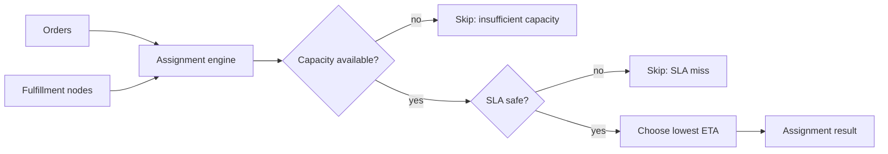

# Marketplace Fulfillment Optimizer

[](https://github.com/SriGantikotaKal/marketplace-fulfillment-optimizer/actions/workflows/python-tests.yml)

A deterministic order-to-node assignment engine for delivery, grocery, logistics, and commerce marketplaces. It chooses fulfillment nodes using available capacity, distance, and delivery SLA rules.

## Why recruiters should care

This shows backend platform thinking for Instacart, DoorDash, Chime-like operations platforms, and commerce companies: capacity-safe allocation, SLA-driven decisions, and explicit skip reasons for debugging.

## Architecture



## Run tests

```powershell
python -m unittest discover -s tests
```

## Run the demo

```powershell
python -m src.cli samples/sample.json
```

## Design decisions

- Capacity is decremented as orders are assigned, preventing hidden over-allocation.
- Skip reasons make allocation failures explainable to operations teams.
- Deterministic sorting makes test results and incident reviews reproducible.

## Roadmap

- Add regional inventory balancing.
- Add priority tiers for enterprise or high-value customers.
- Add batch reporting for unassigned-order root cause analysis.
